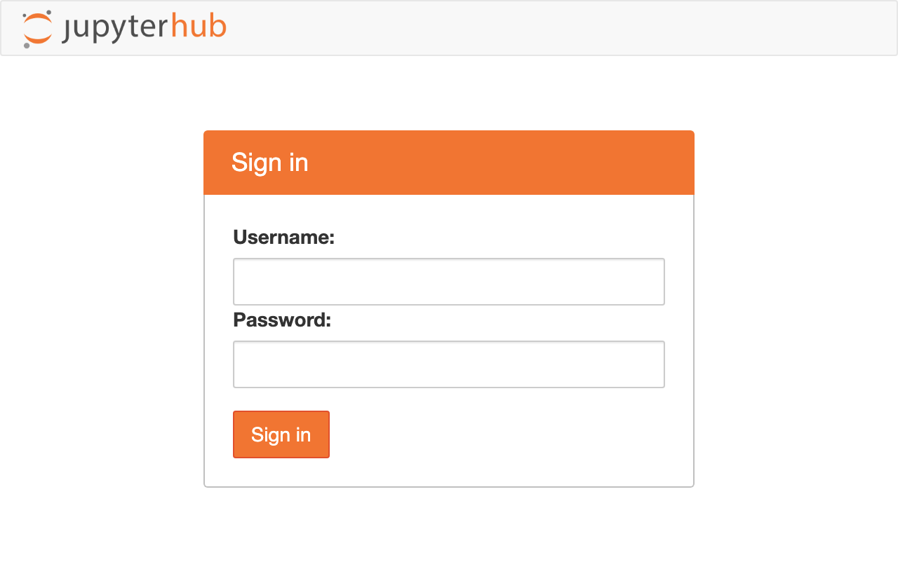
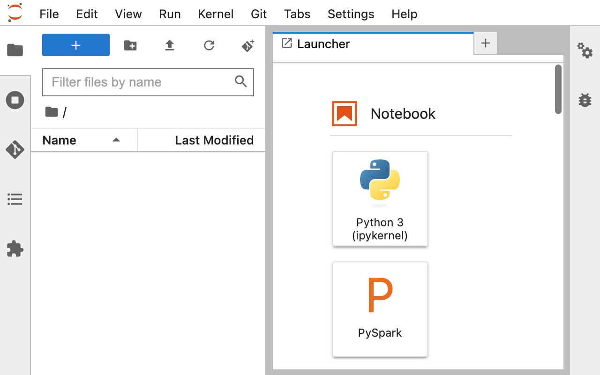
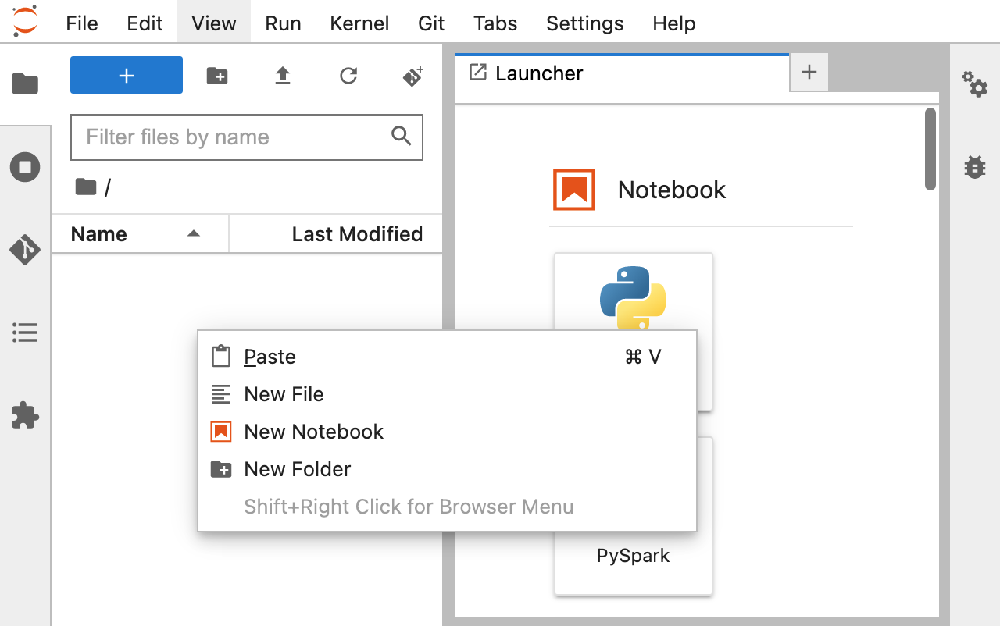
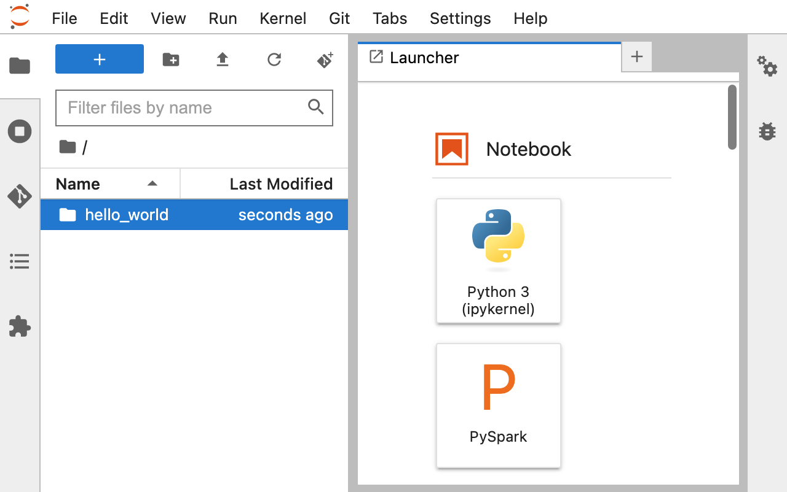
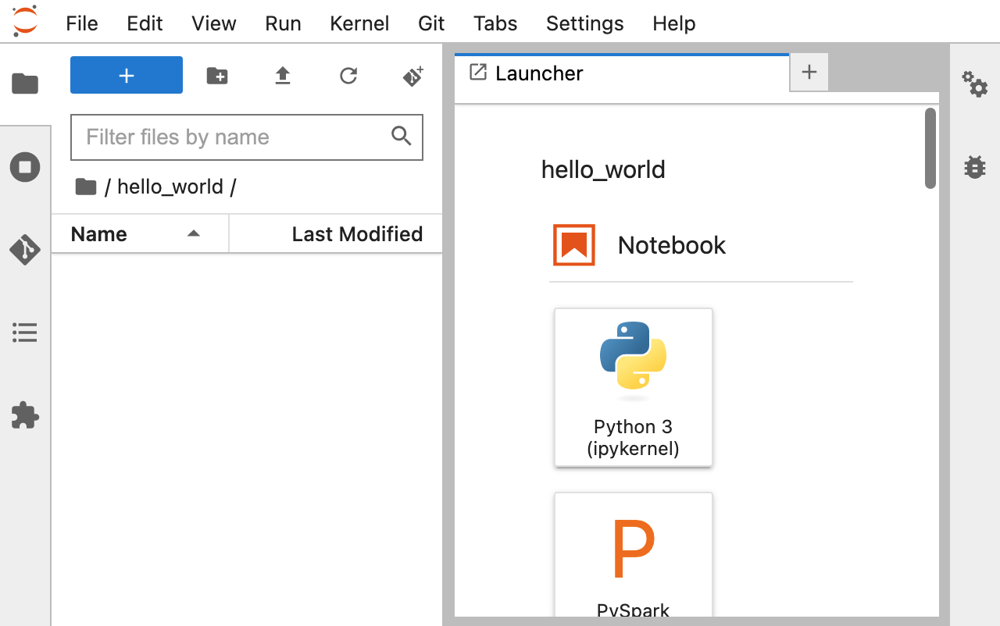
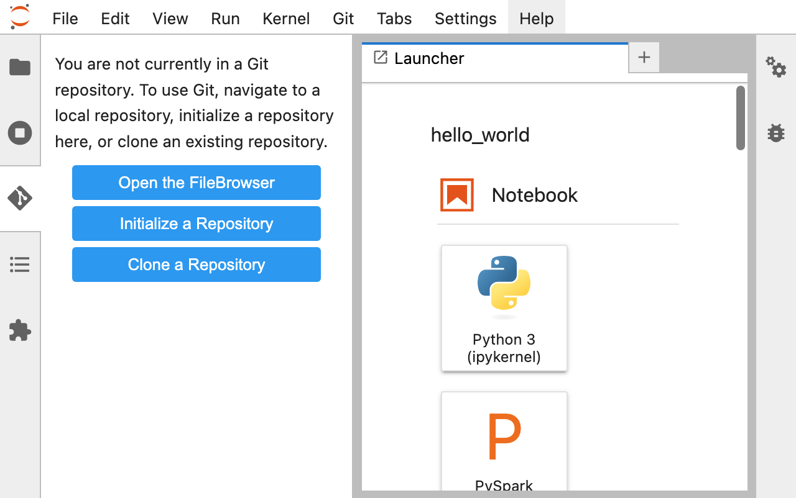
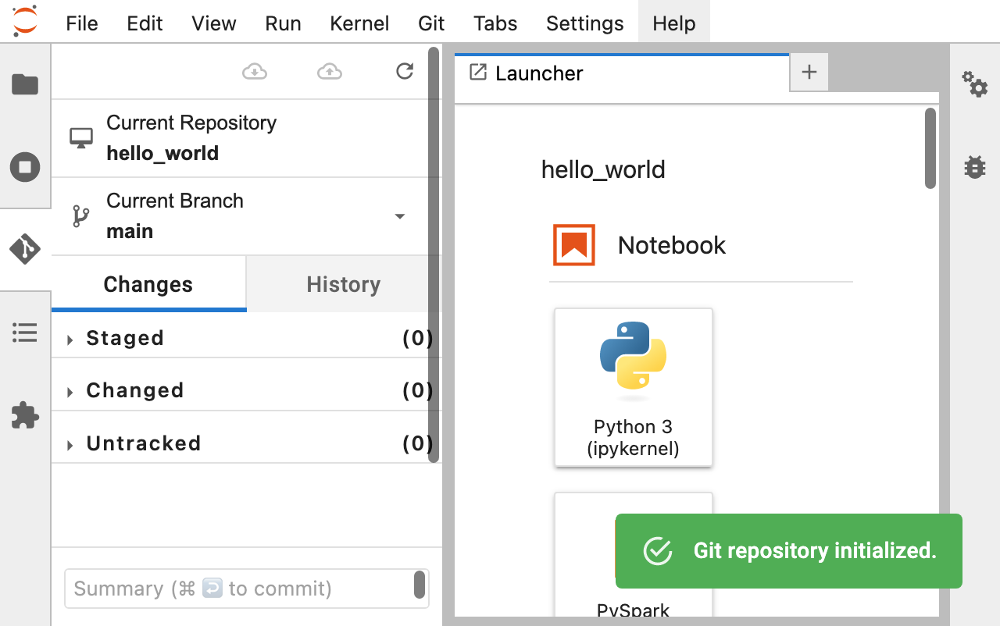

# Version Control (Level 1)

## Contents
- [Introduction to Version Control](#introduction-to-version-control)
- [Getting Started](#getting-started)
- [Git Workflow](#git-workflow)
- [Collaborating](#collaborating)
- [Branches and Tags](#branches-and-tags)
- [DOI Referencing](#doi-referencing)
- [Conclusion and Further Resources](#conclusion-and-further-resources)

## Introduction to Version Control

### What is version control?

Version control is an essential tool for anyone who works with code, and that includes academics who are new to programming. Version control is a system that allows you to keep track of changes to your code over time, and it is especially important when collaborating with others on a project.

Here are some of the benefits of using version control with Git:

- **Collaboration**: Git allows multiple people to work on the same codebase at the same time. It keeps track of who made what changes and when, and it helps to avoid conflicts that can arise when two people make changes to the same file at the same time.

- **History**: Git keeps a complete history of all changes made to your codebase. This means that you can easily see what changes were made, when they were made, and who made them. You can also revert to an earlier version of your code if you make a mistake or want to undo a change.

- **Branching and merging**: Git makes it easy to create new branches of your codebase, which allows you to work on new features or experiments without affecting the main codebase. You can then merge your changes back into the main codebase when they are ready.

- **Backup**: Git provides a reliable and easy-to-use backup system for your codebase. By storing your code in a Git repository, you can ensure that it is backed up regularly and that you can easily restore it if something goes wrong.

Academics who are new to programming should invest time in learning Git because it is an essential tool for anyone working with code. It will help you to collaborate more effectively with others, keep a complete history of changes to your codebase, work on new features without affecting the main codebase, and provide a reliable backup system for your code. With Git, you can focus on your research and experiments, confident that your code is well-organised, well-documented, and easy to manage.

## Getting Started

### Creating a Git repository

1. Open [Jupyter Notebook](https://jupyter.bangor.ac.uk/jupyter) in your browser.
    - Jupyter Notebook is a web-based interactive development environment (IDE) that allows you to create and share documents that contain live code, equations, visualizations, and narrative text.

    

2. Press `ctrl + shift + F` to open the File Browser.
    - The File Browser is where you can navigate and manage files and folders on your system.

    

3. Right-click in the File Browser window and click "New Folder."
    - This will create a new folder where you can store your project files.

    

4. Create a folder named "hello_world."
    - Name your folder whatever you like, but for this tutorial, we will use "hello_world" as an example.

    

5. Double-click the newly created "hello_world" folder to open it.

    

6. Click on the "Git" plugin in the left-hand menu.
    - The Git plugin allows you to manage Git repositories directly from within Jupyter Notebook.

    

7. Click "Initialize a Repository."
    - This will create a new Git repository in your "hello_world" folder.

    

8. Confirm that you want to initialize the "hello_world" directory by clicking "Yes."

    

### Git Plugin View

1. **Current Repository** and **Current Branch**
    - This tab displays the current Git repository and branch that you are working with in Jupyter Notebook.
    - This information can be useful when working with multiple repositories or branches, as it helps you keep track of which one you are currently working on.

2. **Changes**
    - This tab displays the changes that have been made to files in the current Git repository.
    - The changes are grouped into three categories: "**Staged**," "**Changed**," and "**Untracked**."
        - **Staged** changes are changes that have been added to the Git staging area and are ready to be committed.
        - **Changed** changes are changes that have been made to files but have not yet been added to the staging area.
        - **Untracked** changes are changes that have been made to files that are not yet being tracked by Git.

### Using the Jupyter Notebook plugin to run Git commands

### Git Workflow
    - Checking the status of your repository
    - Adding files to the repository
    - Ignoring files
    - Committing changes
    - Viewing commit history
    - Undoing changes
    - Using the Jupyter Notebook plugin to manage Git workflow

### Collaborating
    - Cloning a repository
    - Pushing changes to a remote repository
    - Pulling changes from a remote repository
    - Resolving merge conflicts
    - Using the Jupyter Notebook plugin to collaborate with others

### Branches and Tags

###  DOI Referencing 

### Conclusion and Further Resources
    - Recap of the benefits of using version control
    - Additional resources for learning more about Git and version control
