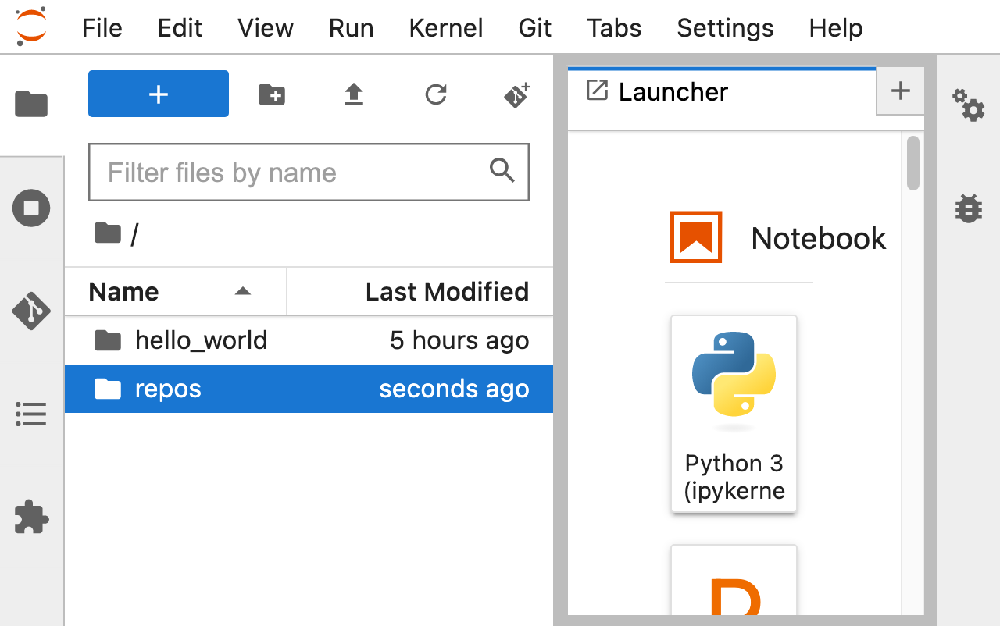
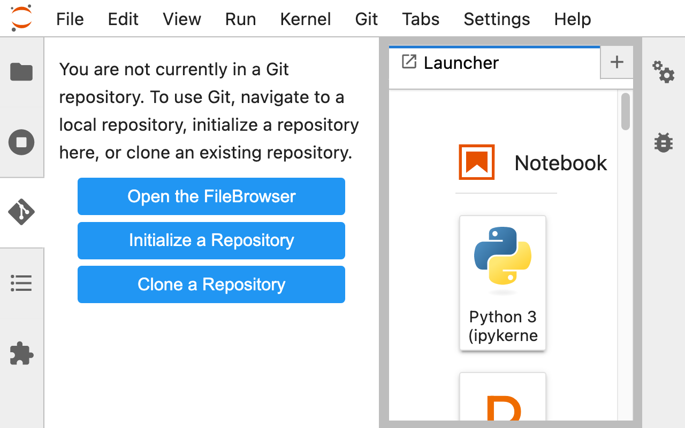
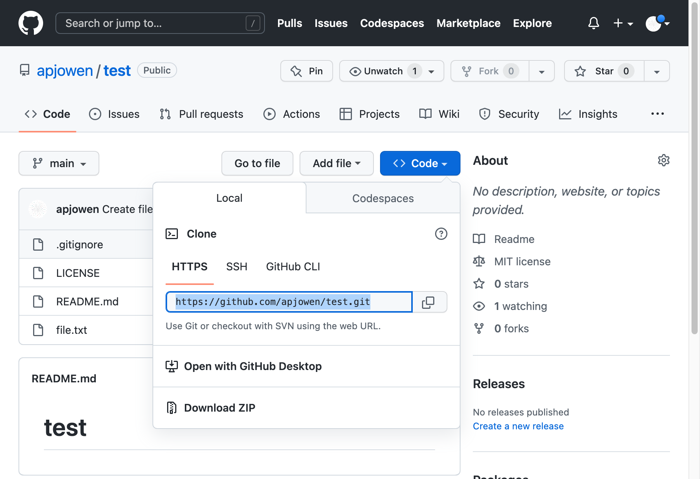
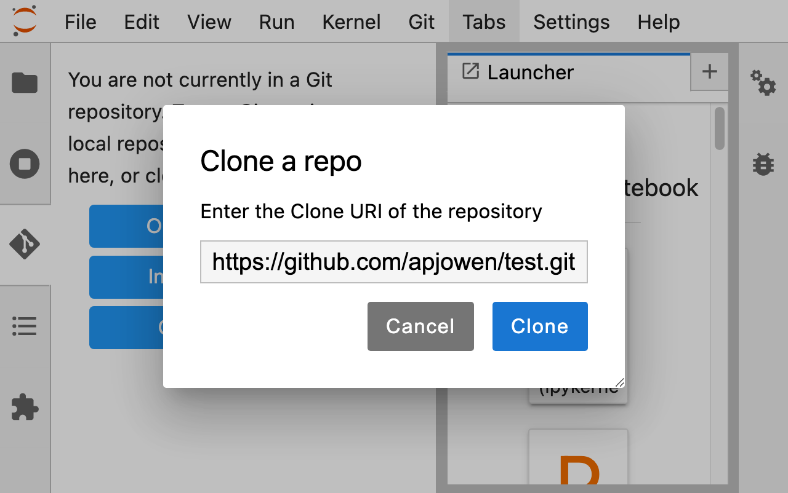
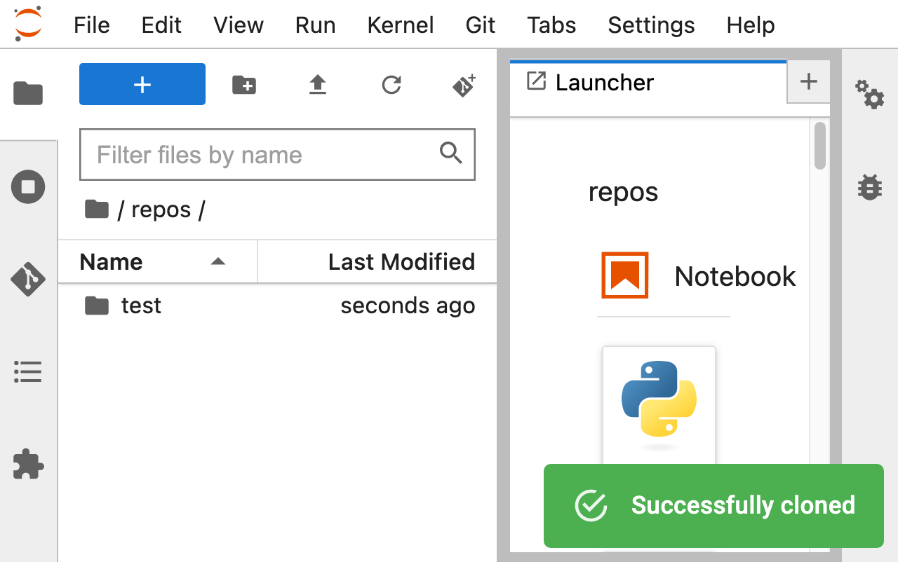
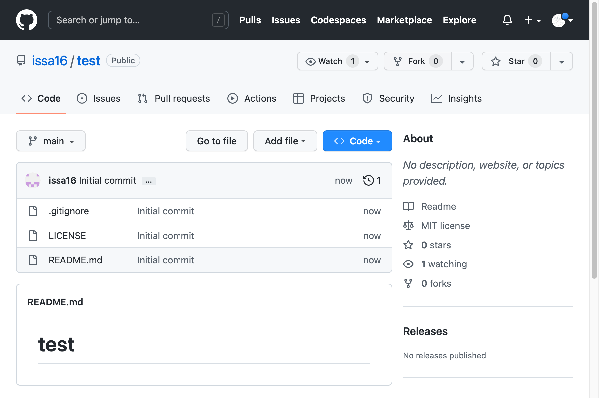
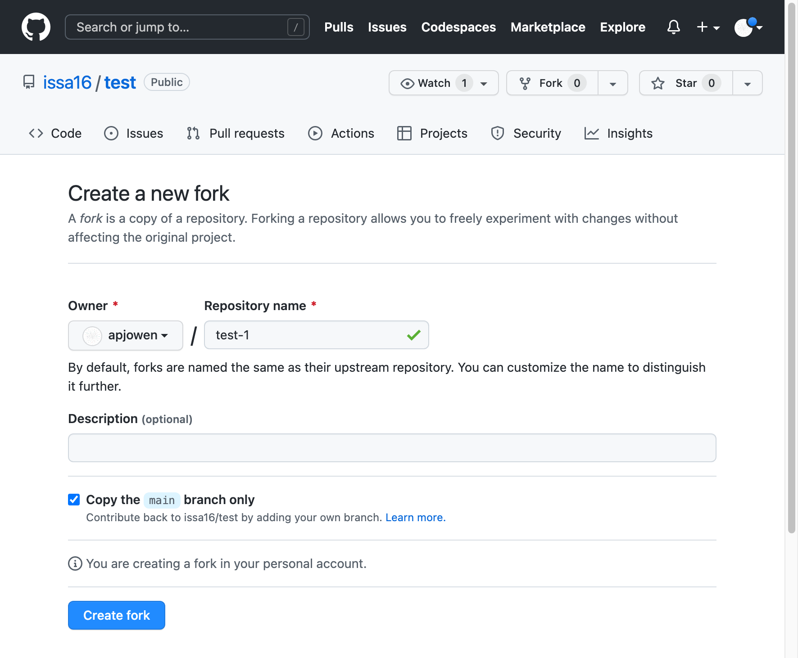
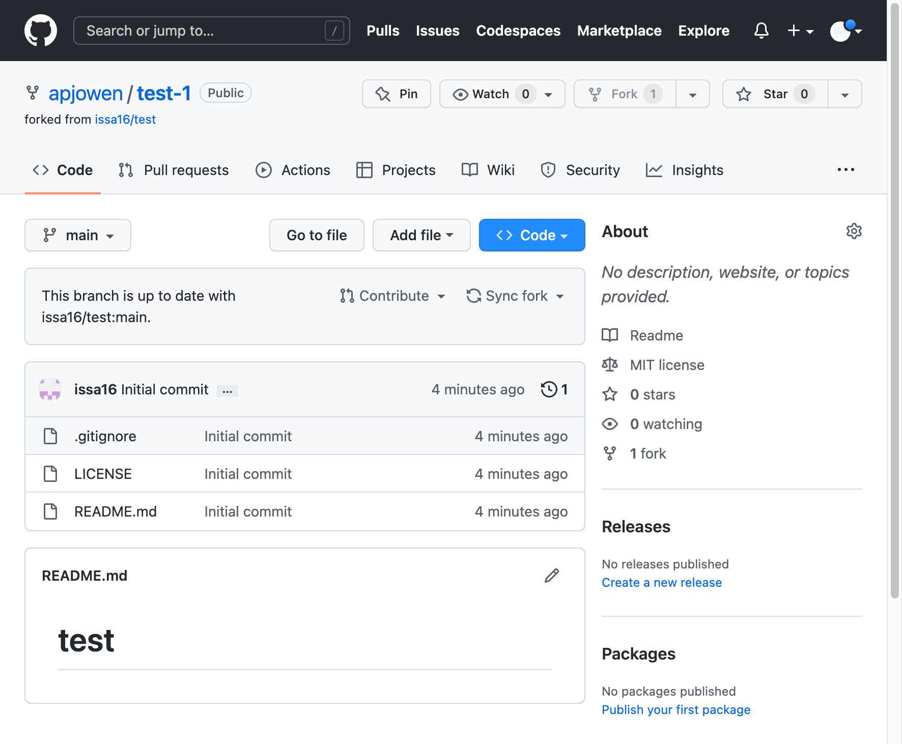

## Cloning and Forking

1. [Cloning](#cloning)
2. [Forking](#forking)

### Cloning
---
Cloning refers to creating a copy of an existing repository. When you clone a repository, you download a copy of the entire repository to your local machine. This allows you to work on the code locally and make changes without affecting the original repository. Cloning is useful if you want to contribute to an existing project or if you want to create a local backup of a repository.

1. Open the File Browser in Jupyter Notebook by pressing `ctrl + shift + F` (Windows) and create a new directory named "repos".

    

2. Double click the directory named "repos".

    

3. Click on the Git plugin in the left-hand menu and select "Clone a Repository".

    

4. Obtain the URL of the repository you want to clone by clicking on the "Code" button on its GitHub page. 

    

5. Then, enter the URL in the "Clone a repo" dialog box.

    

6. Click "Clone" and wait for the clone to complete.

7. Once the clone is complete, navigate to the "repos" directory where the repository was cloned to.

    

8. Make any changes to the project and stage them as necessary.

9. Click on the Git plugin and select "Push" to push your changes to the remote repository.

### Forking
---

Forking is a powerful tool that allows you to create your own copy of an existing repository on your GitHub account. You can use forking to experiment with changes, to start your own version of a project, or to contribute changes back to the original repository.

1. Navigate to the [repository](https://github.com/issa16/test) you want to fork on the GitHub website.

2. Click the "Fork" button in the top right corner of the repository page.

    

3. Review the settings for the Owner, Repository Name and Description and click the 'Create fork' button.

    

4. Once the repository has been forked, navigate to your own GitHub profile and locate the forked repository.

    

5. After forking the repository, you can now clone the forked repository using the instructions provided in the previous section titled 'Cloning' and by using the URL of the forked repository on GitHub.
