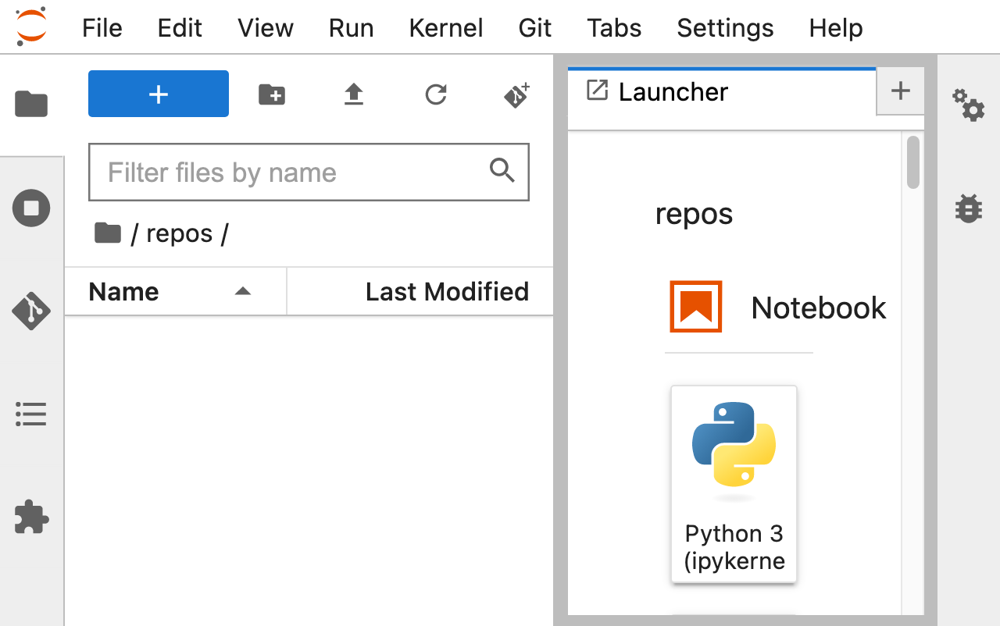

## Cloning and Forking

1. [Cloning](#cloning)
2. [Forking](#forking)

### Cloning
---
Cloning refers to creating a copy of an existing repository. When you clone a repository, you download a copy of the entire repository to your local machine. This allows you to work on the code locally and make changes without affecting the original repository. Cloning is useful if you want to contribute to an existing project or if you want to create a local backup of a repository.

1. Open the File Browser in Jupyter Notebook by pressing `ctrl + shift + F` (Windows) and create a new directory named "repos".

    

2. Double click the directory named "repos".

    

3. Click on the Git plugin in the left-hand menu and select "Clone a Repository".

    

4. Obtain the URL of the repository you want to clone by clicking on the "Code" button on its GitHub page. 

    

5. Then, enter the URL in the "Clone Repository" dialog box.

    

6. Click "Clone" and wait for the clone to complete.

    

7. Once the clone is complete, navigate to the "repos" directory where the repository was cloned to.

    

8. Make any changes to the project and stage them as necessary.

9. Click on the Git plugin and select "Push" to push your changes to the remote repository.

### Forking
--
Forking refers to creating a copy of an existing repository on your Github account. This allows you to have your own copy of the repository that you can modify and make changes to. You can use forking to start your own version of a project, to experiment with changes, or to contribute changes back to the original repository.

1. Navigate to the repository you want to fork on the GitHub website.

2. Click the "Fork" button in the top right corner of the repository page.

3. Select the account or organization where you want to fork the repository to.

4. Once the repository has been forked, navigate to your own GitHub profile and locate the forked repository.
Click on the Git plugin in the left-hand menu and select "Clone a Repository".
Enter the URL of your forked repository and choose a local directory to clone it into.
Click "Clone" and wait for the clone to complete.
Once the clone is complete, navigate to the local directory where the repository was cloned to.
Open the Jupyter Notebook and navigate to the forked project.
Make any changes to the project and stage them as necessary.
Click on the Git plugin and select "Push" to push your changes to your forked repository. If you want to contribute your changes to the original repository, you can create a pull request from your forked repository to the original repository.
