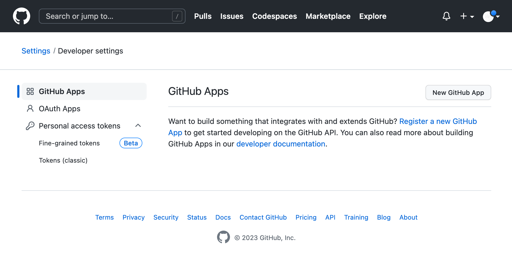
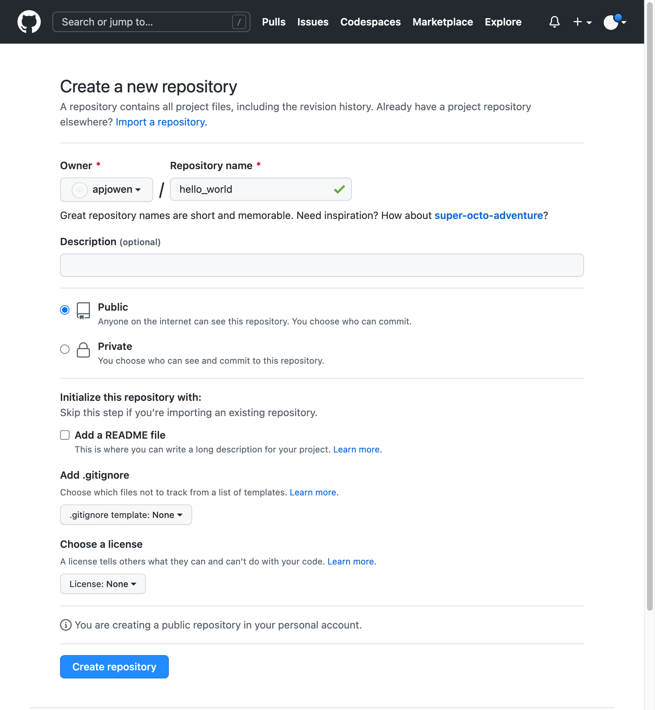

## Collaborating

1. [Overview](#overview)
2. [Create a Github account](#create-a-github-account)
3. [Connect local git repository to remote (Github) git repository]()
4. [Push (upload) changes to Github]()
5. [Pull (Donwload) changes from Github]()

### Overview
---
Version control is useful because it allows you to keep track of changes to your code over time. This is particularly important when collaborating with others, as it enables multiple people to work on the same codebase without overwriting each other's changes.

One popular version control system is Git, which is designed to be lightweight and easy to use. Git allows you to create a local repository on your computer, where you can track changes to your code, and then push those changes to a remote repository, such as GitHub, where you can collaborate with others.

Connecting your local repository to GitHub involves a few steps. First, you need to create a GitHub account and a new repository. Then, you need to add your remote repository URL to your local Git repository, which allows you to push changes to GitHub. Finally, you can push your changes to GitHub, where they will be visible to others who have access to the repository.

By connecting your local repository to GitHub, you make it easy to collaborate with others, as you can easily share your code changes and keep everyone up to date with the latest version of the code.

### Create a Github account
---
1. Go to the GitHub website: https://github.com/

2. Click the "Sign up" button in the top right corner of the page.

3. Enter your desired email address, password, and username. 
    - Make sure to choose a strong password and a unique username that reflects your identity or your project.

4. Select the plan that suits your needs. 
    - GitHub offers a free plan for public repositories and a paid plan for private repositories with advanced features.

5. Complete the "Captcha" verification to confirm that you are not a robot.

6. Click the "Create account" button to create your account.

7. Verify your account by entering the 8-digit code sent to your email address. 
    - This step is necessary to confirm your identity and prevent spam accounts.

8. Once you have verified your account, you will be taken to your GitHub dashboard. 
  - From here, you can explore GitHub's features, create new repositories, join or create organizations, and collaborate with other developers.

    

### Create a personal access token on GitHub
---
GitHub has recently updated its authentication policies and now requires users to provide a personal access token to access repositories via the command line or other third-party tools. This is to improve security and prevent unauthorized access to user accounts.

To create a personal access token on GitHub:

1. Log in to your GitHub account and click on your profile icon in the top-right corner of the page.

2. From the dropdown menu, click on "Settings" and then click on "Developer settings" in the left-hand menu.

    

3. In the developer settings page, click on "Personal access tokens" and then click on "Tokens (classic)".

    

4. Click the "Generate new token" button and select "Generate new token (classic).

    

5. Give your token a descriptive name and select the appropriate permissions for your use case.
    - For this tutorial we will set the token to expire in 30 days and for the token to have full control of private repositories.

    

5. Scroll down and click on the "Generate token" button.

6. Once the token has been generated, copy it to a safe place, as you will not be able to see it again.

You can now use this personal access token as your password when accessing GitHub repositories via the command line or other third-party tools.

### Create a GitHub repository

1. To create a new repository on Github, click the "New" button on the left-hand side of Github Dashboard.

8. Give your repository a name and a brief description.

9. Choose the "Public" option.

10. You can choose to initialize the repository with a README file, which can provide a brief introduction to your project. This step is optional.

11. Click the "Create repository" button.

    

**Connect the local git repository to the remote Github repository**

2. Configure the repo?

### Push (upload) changes to Github
---
1. Open Jupyter Notebook and navigate to your project directory in the file browser.

2. Make sure your local changes have been committed by following the steps in the previous sections of this guide.

3. Click on the "Git" plugin in the left-hand menu.

4. Click the "Push" button to upload your changes to Github.

5. You may be prompted to enter your Github login credentials if you haven't already done so.

6. After successfully logging in, the plugin will start uploading your changes to the remote Github repository.

7. Once the upload is complete, go to your Github repository page to verify that your changes have been successfully uploaded.

If you encounter any issues while pushing your changes to Github, double-check that your local and remote repositories are properly connected.

### Pull (Donwload) changes from Github
---
1. Open the Jupyter Notebook Git plugin and click on the "Pull" button in the left-hand menu.

2. The plugin will then check for any changes in the remote repository that are not present in your local repository.

3. If there are any changes, the plugin will display them in the "Changes" tab.

4. Review the changes and make sure you understand what has been updated.

5. If you are satisfied with the changes, click the "Merge" button to update your local repository with the changes from the remote repository.

6. If there are conflicts between the changes in the remote and local repositories, the plugin will display a message indicating that a merge conflict has occurred.

7. In this case, you will need to manually resolve the conflict by reviewing the changes and deciding which changes to keep and which to discard.

8. Once you have resolved the conflicts, click the "Merge" button to update your local repository with the changes from the remote repository.

Your local repository should now be updated with the latest changes from the remote repository.
