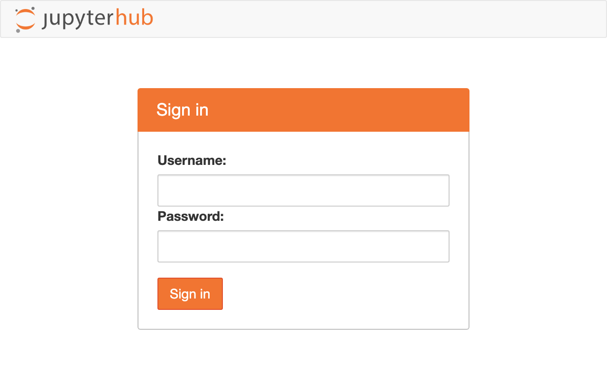
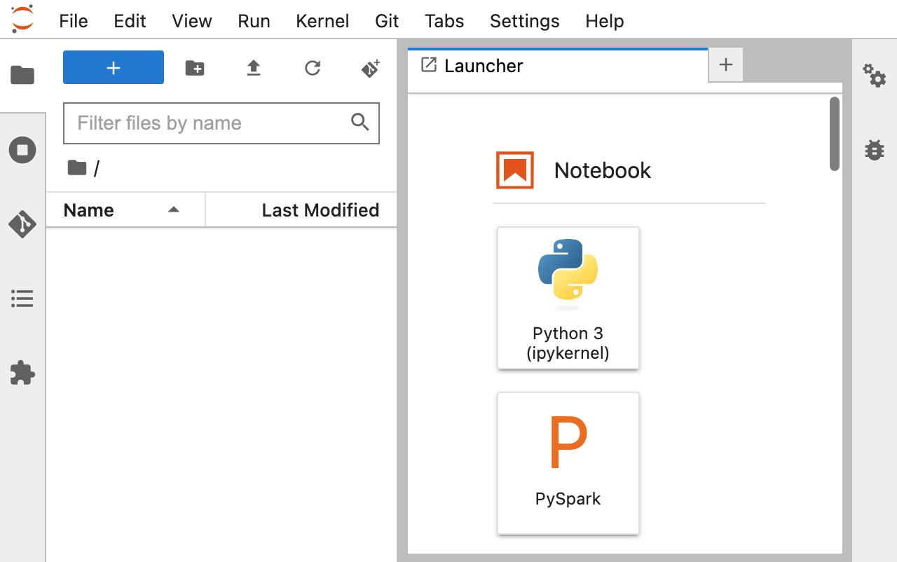
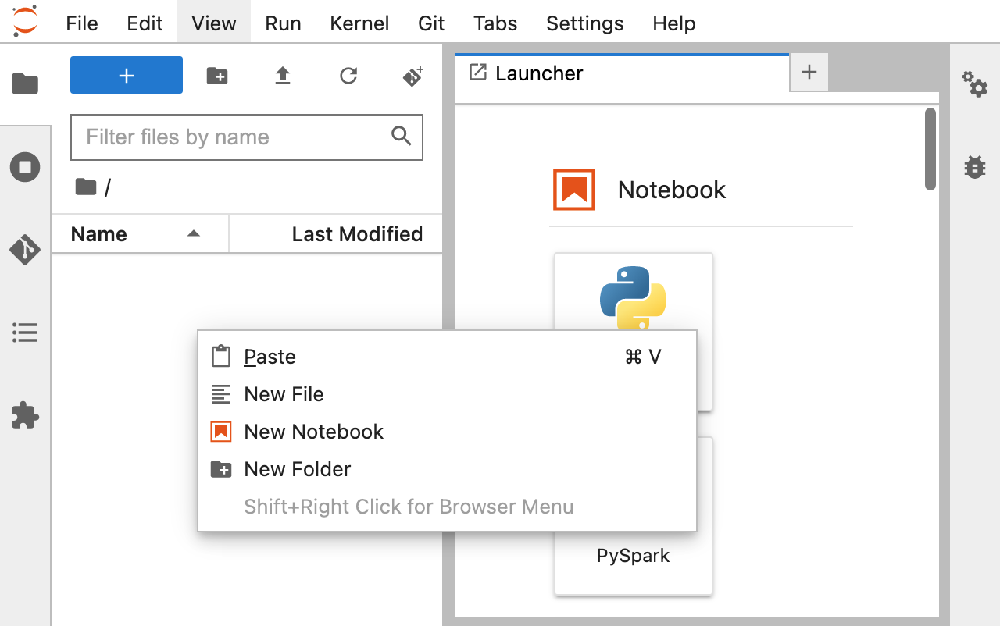
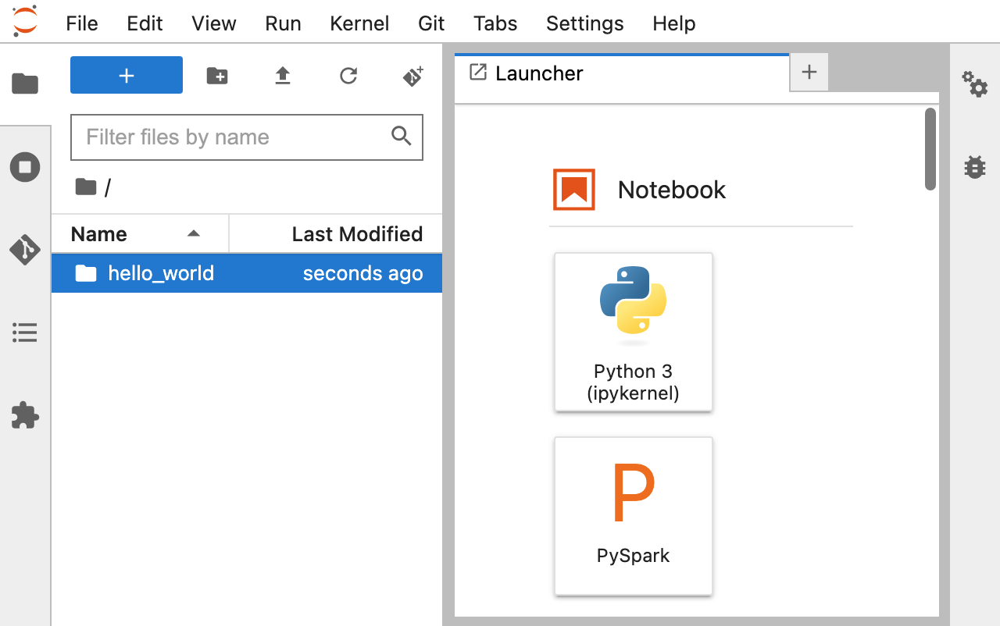
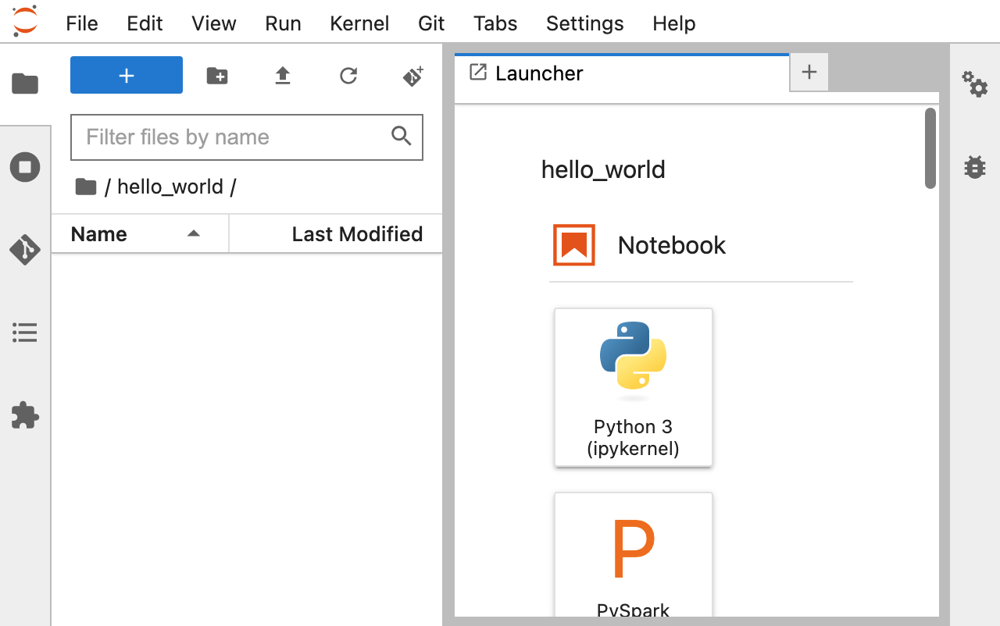
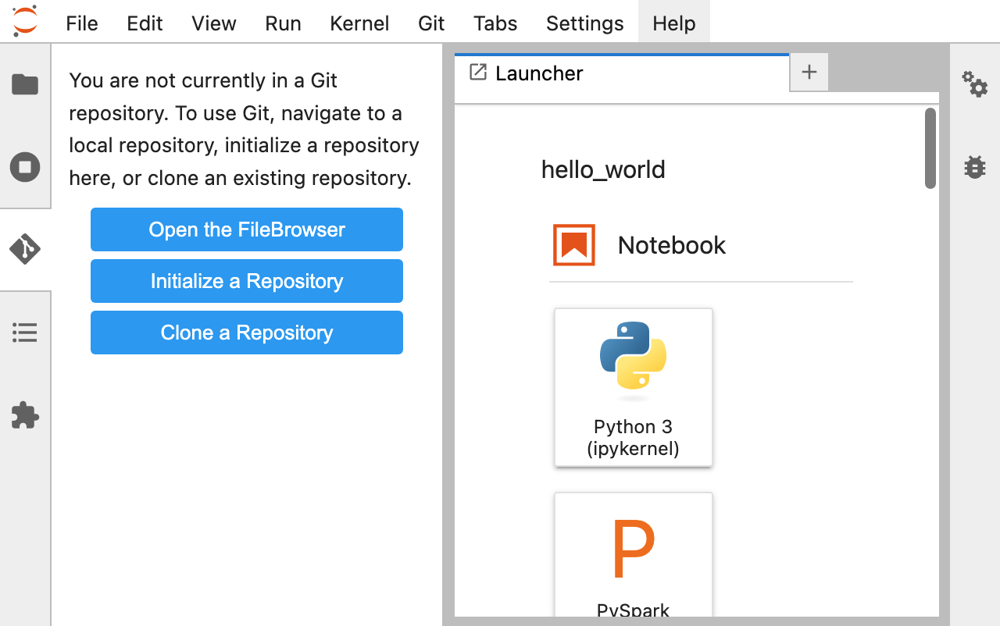
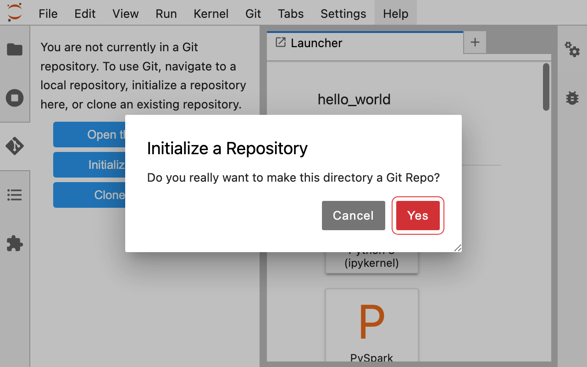
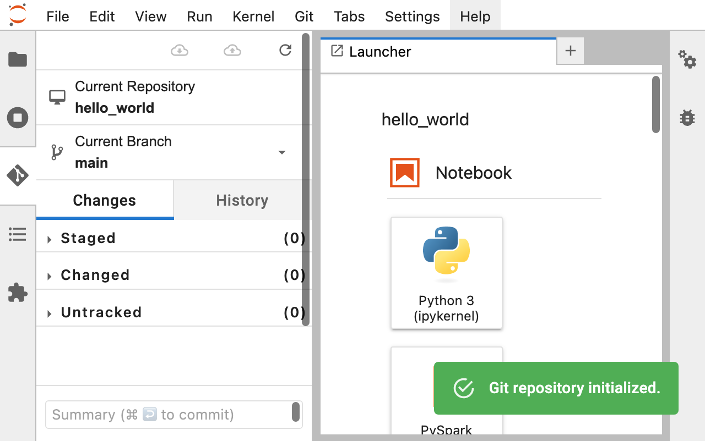

## Getting Started

### Creating a Git repository

1. Open [Jupyter Notebook](https://jupyter.bangor.ac.uk/jupyter) in your browser.
    - Jupyter Notebook is a web-based interactive development environment (IDE) that allows you to create and share documents that contain live code, equations, visualizations, and narrative text.

    

2. Press `ctrl + shift + F` (Windows) to open the File Browser.
    - The File Browser is where you can navigate and manage files and folders on your system.

    

3. Right-click in the File Browser window and click "New Folder"
    - This will create a new folder where you can store your project files.

    

4. Create a folder named "hello_world."
    - Name your folder whatever you like, but for this tutorial, we will use "hello_world" as an example.

    

5. Double-click the newly created "hello_world" folder to open it.

    

6. Click on the "Git" plugin in the left-hand menu.
    - The Git plugin allows you to manage Git repositories directly from within Jupyter Notebook.

    

7. Click "Initialize a Repository."
    - This will create a new Git repository in your "hello_world" folder.
    - Initializing a repository is an important step in version control with Git. By initializing a repository, you are essentially telling Git to start tracking changes to your files and directories within that repository.

    

8. Confirm that you want to initialize the "hello_world" directory by clicking "Yes."
    - When you initialize a repository, Git will create a hidden directory named ".git" within your "hello_world" folder. This directory contains all of the metadata that Git uses to track changes and manage the repository.

    

