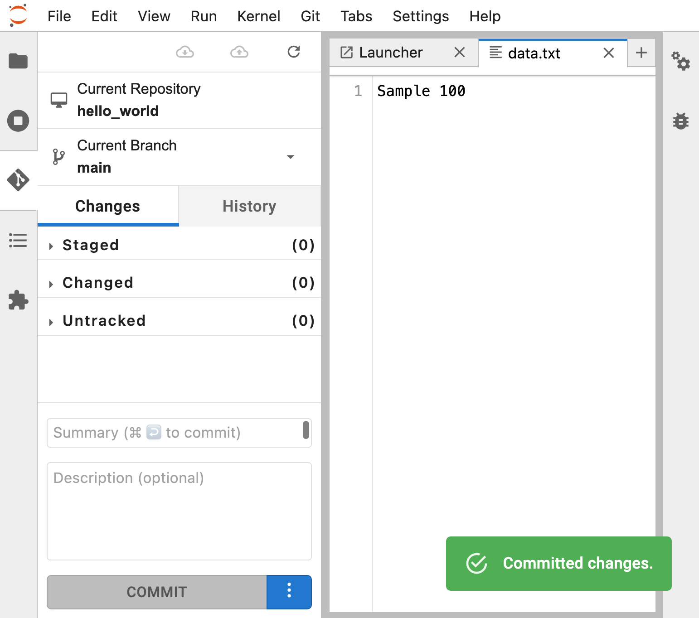

## Git Workflow

1. [Add files](#add-files)
2. [Committing changes](#committing-changes)
3. [Viewing commit history](#viewing-commit-history)
4. [Add changes](#add-changes)
5. [Ignoring files](#ignoring-files)
6. [Resources](#resources)

### Add files
1. Open the File Browser in Jupyter Notebook by pressing `ctrl + shift + F` (Windows) and navigate to the "hello_world" directory by double-clicking on it.

    

2. Right-click in the File Browser window and select "New File" to create a new file.

    

3. Name the file "data.txt" and double-click on it to open it.

    

4. Add some text to the file and save it by pressing `ctrl + s`.

    

5. Open the Git plugin in the left-hand menu and look for the "data.txt" file. 
    - It should be listed as an untracked file, which means that Git is aware of its existence, but it is not yet being tracked for changes.

    

6. To start tracking changes to "data.txt", right-click on the file and select "Track".
    - This will add the file to the staging area, which is a way to prepare changes for committing. 
    - The staging area allows you to selectively choose which changes to include in the next commit, which can be useful if you have made multiple changes to different files.

    

Tracking files is an important step in the Git workflow because it allows you to keep track of changes made to your project over time. By tracking files, you can see what changes have been made and when, and you can also revert to earlier versions of your project if needed. The staging area is a key part of this process because it allows you to review and selectively choose which changes to commit.

### Committing changes
---
1. Click the "Changes" tab in the Git plugin.

    

2. Review the changes listed under the "Staged" section. 
    - These are changes that have been added to the staging area and are ready to be committed.

3. In the "Commit" section, enter a commit message that describes the changes you are making. 
    - A commit is like a snapshot of your code at a particular point in time, so it's important to write a good commit message that accurately describes the changes you're making. A good commit message should be descriptive, concise, and written in the present tense.

    

4. Click "Commit". 
    - This will save the changes you have staged in the previous step to your local Git repository. It's important to commit your changes regularly so that you can easily track the progress of your project and roll back changes if necessary. However, note that the changes are still only saved to your local repository at this point. If you want to share your changes with others or push them to a remote repository, you will need to perform additional steps.

    

### Viewing commit history
---
1. Click the "History" tab in the Git plugin.
    - This allows you to view a chronological list of all the commits made to your repository, starting from the most recent one.

    

2. By reviewing the commit history, you can see the changes that were made to the repository over time, who made the changes, and when the changes were made.
    - This can help you track the progress of your project and understand how it has evolved.

3. Click on a specific commit to view more details about it, such as the commit message, the author, and the date and time it was committed.
    - This information can provide additional context about the changes that were made and help you troubleshoot any issues that arise.

    

### Add changes
---
1. Press `ctrl + shift + F`(Windows) to open the File Browser and double-click on the "hello_world" directory.

    

2. Double click the file named "data.txt" and add change the text and press `ctrl + s` to save the file.

    

3. Click on the "Git" plugin in the left-hand menu and select the "Changes" tab. Here, you will see that "data.txt" is now listed under the "Changed" tab.

    

4. Right-click on the "data.txt" file and click "Diff" to see the changes you made to the file. 
    - You can toggle the Git plugin tab by clicking the icon to make more screen space.

    

 

5. If you are happy with the changes, right-click the "data.txt" file and click "Stage". 
    - This will add the file to the staging area, ready for the next commit.

    

 

6. Enter a commit message that describes the changes you are making in the "Commit" section.

    

 

7. Click "Commit" to save the changes to your local Git repository.

    

 

### Ignoring files
---
1. Press `ctrl + shift + F` (Windows) to open the File Browser and double-click on the "hello_world" directory.

    

2. Create a new file in the directory and name it "config.ini".

    

3. Click on the "Git" plugin in the left-hand menu and select the "Changes" tab. 
    - Here, you will see that "config.ini" is listed under the "Untracked" tab.

    

4. To tell Git to ignore this file, right-click the "config.ini" file and select "Ignore this file". 
    - You can also choose to ignore all files with the same extension by clicking "Ignore .ini extension".

    

5. After ignoring the file, you should see a new file called ".gitignore" listed under the "Untracked Files" section in the "Changes" tab.

6. Right-click on the ".gitignore" file and select "Track" to stage it for the next commit.

7. You should now see the ".gitignore" file listed under the "Staged Changes" section in the "Changes" tab.

8. Enter a commit message that describes the changes you are making in the "Commit" section.

9. Click "Commit" to save the changes to your local Git repository.

### Resources
---
[A collection of useful .gitignore templates](https://github.com/github/gitignore)
