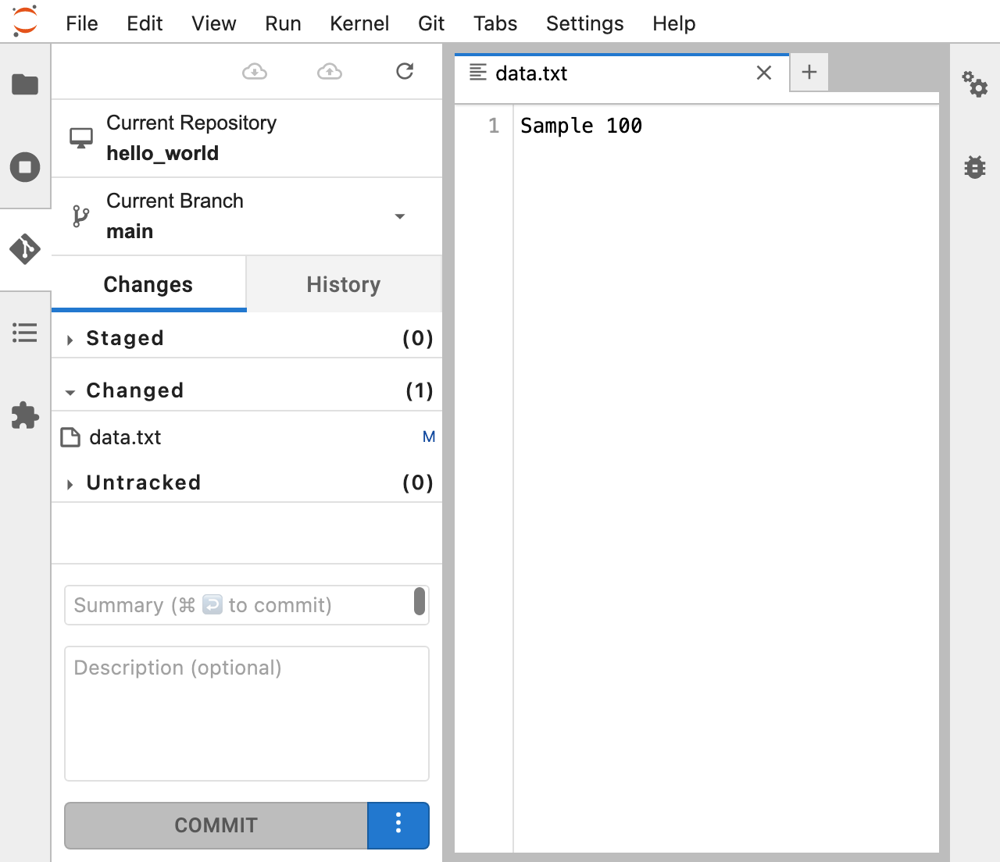
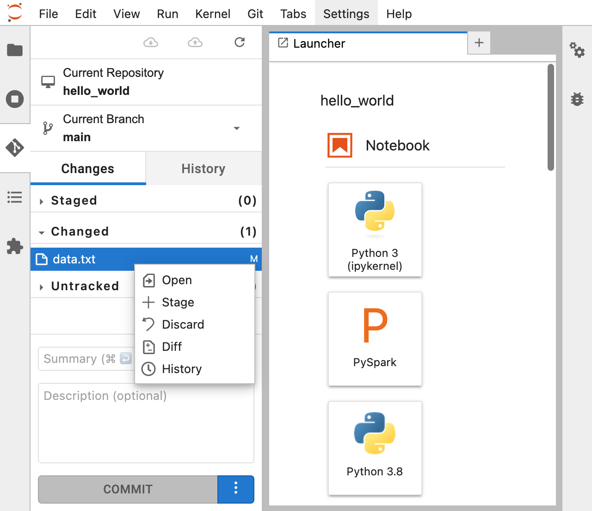
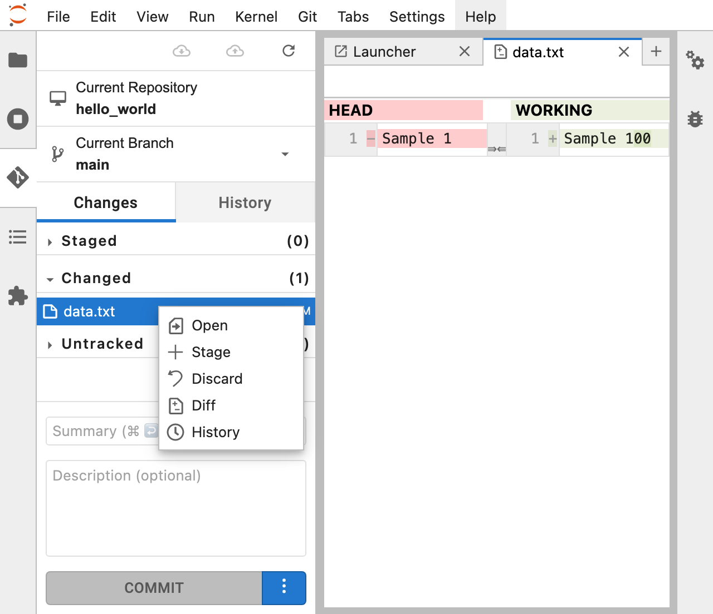
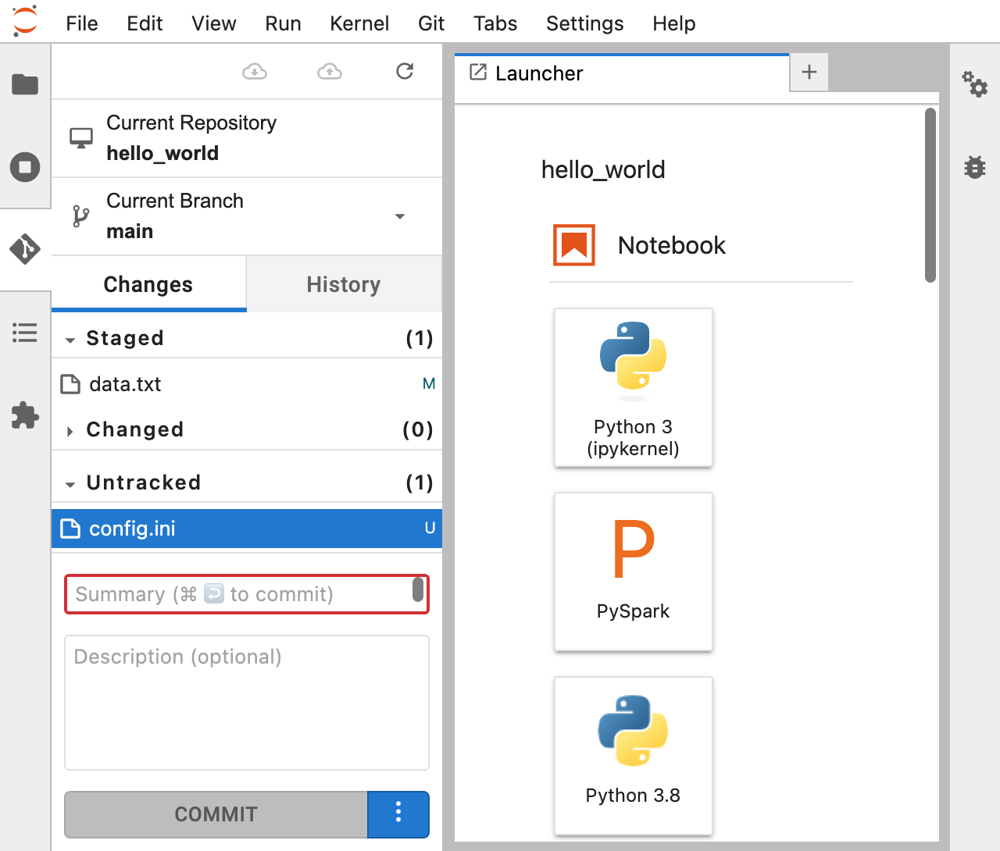
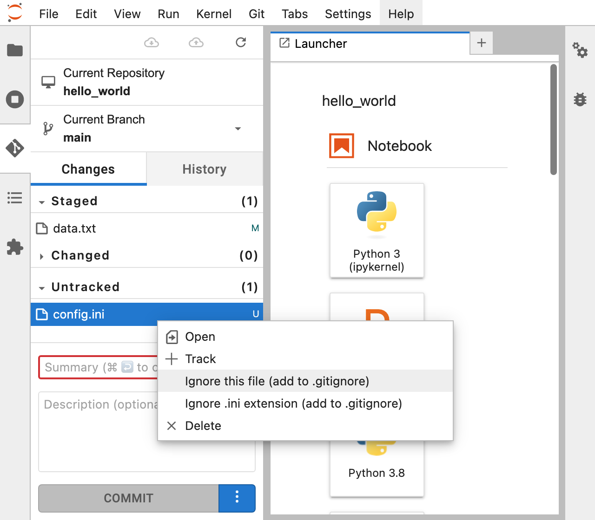

## Git Workflow

### Add files
---
1. Press `ctrl + shift + F`(Windows) to open the File Browser and double click the "hello_world" directory.

    

2. Right-click in the File Browser window and click "New File"

    

3. Create a file named "data.txt"

    

4. Double click the file named "data.txt" and add some text and press `ctrl + s` to save the file.

    

5. Click on the "Git" plugin in the left-hand menu, you should see that "data.txt" file is now listed as an untracked file.
    - This means that Git is aware of the file's existence, but it is not yet being tracked for changes.

    

6. To start tracking changes to "data.txt", right-click on the file and click "Track".
    - This will add the file to the staging area and prepare it for the next commit.

    

### Committing changes
---

1. Click the "Changes" tab in the Git plugin.

    

2. Review the changes listed under the "Staged" section. 
    - These are changes that have been added to the staging area and are ready to be committed.

3. In the "Commit" section, enter a commit message that describes the changes you are making.

    

4. Click "Commit". 
    - This will save the changes you have staged in the previous step to your local Git repository.

    

### Viewing commit history
---

1. Click the "History" tab in the Git plugin.
    - You should see a list of commits, with the most recent one at the top.

    

2. Click on a commit to view more details about it, such as the commit message, the author, and the date and time it was committed.

    

  
### Add changes
---
1. Press `ctrl + shift + F`(Windows) to open the File Browser and double-click on the "hello_world" directory.

    

2. Double click the file named "data.txt" and add change the text and press `ctrl + s` to save the file.

    

3. Click on the "Git" plugin in the left-hand menu and select the "Changes" tab. Here, you will see that "data.txt" is now listed under the "Changed" tab.

    

4. Right-click on the "data.txt" file and click "Diff" to see the changes you made to the file. 
    - You can toggle the Git plugin tab by clicking the icon to make more screen space.

    

 

5. If you are happy with the changes, right-click the "data.txt" file and click "Stage". 
    - This will add the file to the staging area, ready for the next commit.

    

 

6 .Enter a commit message that describes the changes you are making in the "Commit" section.

11. Click "Commit" to save the changes to your local Git repository.

### Ignoring files
---

1. Press `ctrl + shift + F`(Windows) to open the File Browser and double-click on the "hello_world" directory.

    

2. Create a new file in the directory and name it "config.ini". 

    

4. Click on the "Git" plugin in the left-hand menu and select the "Changes" tab. Here, you will see that "config.ini" is listed under the "Untracked" tab.

    

3. To notify git to ignore this file, right click the config.ini file and click 'Ignore this file'
    - If you wish to ignore all .ini files, click 'Ignore .ini extension'

    

7. You should see your ".gitignore" file listed under the "Untracked Files" section.

8. Right-click on the ".gitignore" file and select "Track".

9. You should now see the ".gitignore" file listed under the "Staged Changes" section.

10 .Enter a commit message that describes the changes you are making in the "Commit" section.

11. Click "Commit" to save the changes to your local Git repository.

**Resources**

[A collection of useful .gitignore templates](https://github.com/github/gitignore)
