## Git Workflow

### Add files
1. Press `ctrl + shift + F`(Windows) to open the File Browser and double click the "hello_world" directory.

    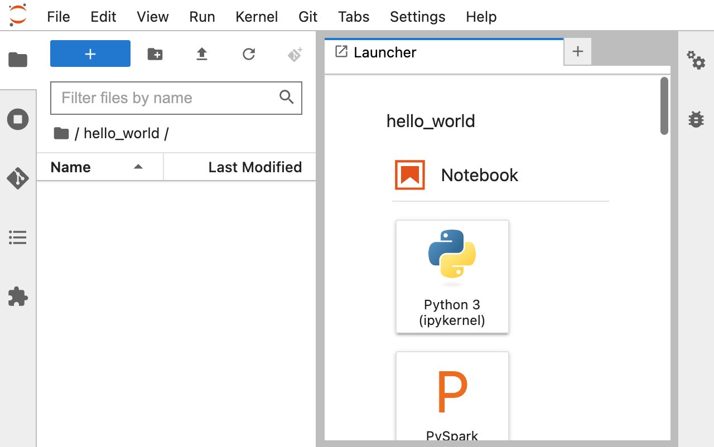

2. Right-click in the File Browser window and click "New File"

    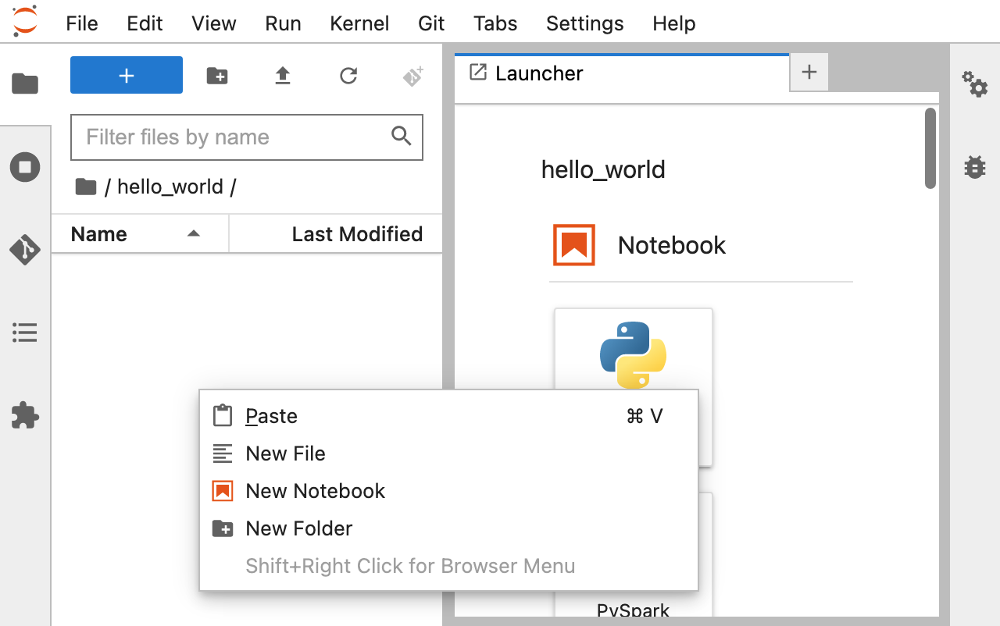

3. Create a file named "data.txt"

    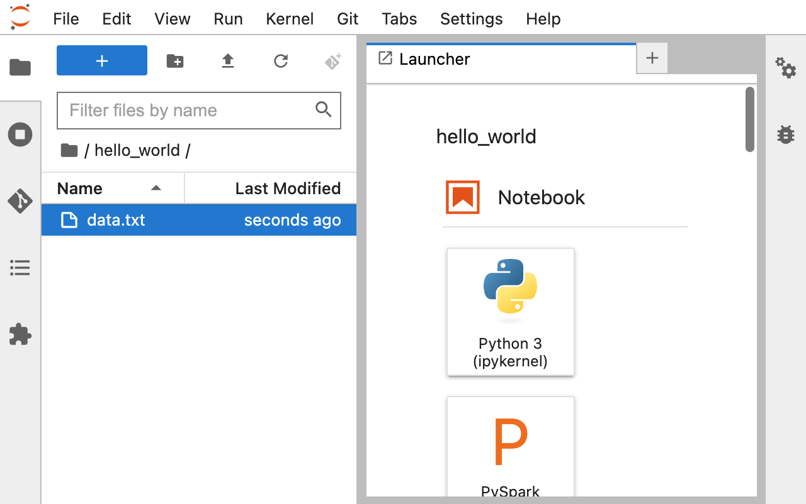

4. Double click the file named "data.txt" and add some text and press `ctrl + s` to save the file.

    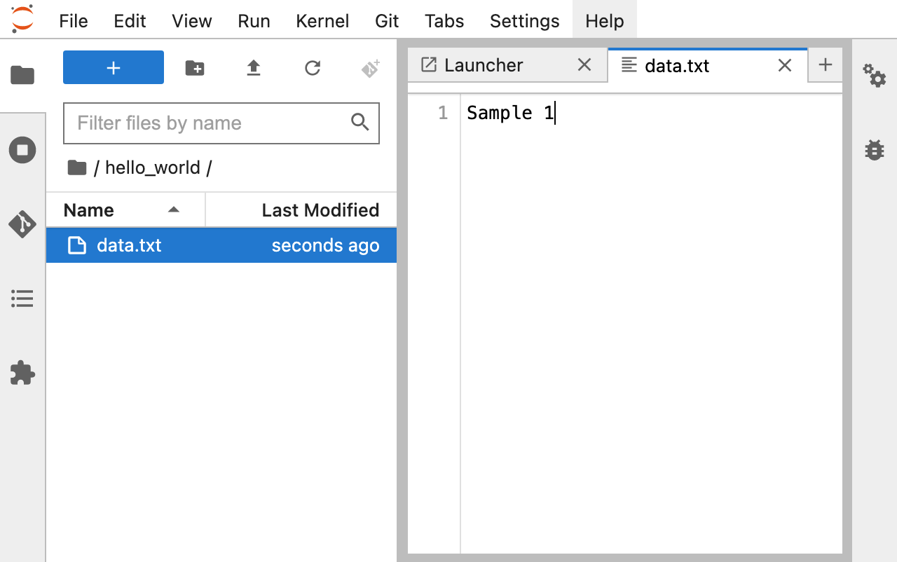

4. Click on the "Git" plugin in the left-hand menu, you should see that "data.txt" file is now listed as an untracked file.
    - This means that Git is aware of the file's existence, but it is not yet being tracked for changes.

    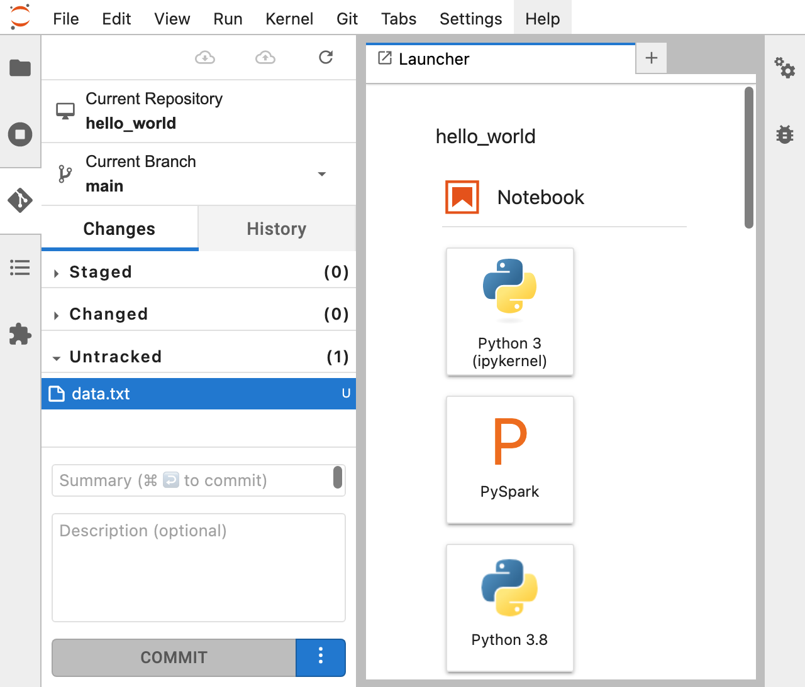

6. To start tracking changes to "data.txt", right-click on the file and click "Track".
    - This will add the file to the staging area and prepare it for the next commit.

    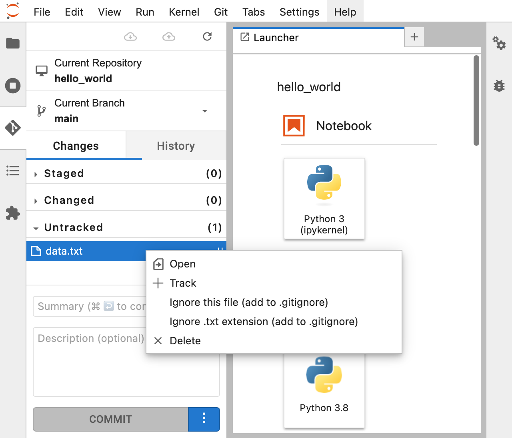

### Committing changes

1. Click the "Changes" tab in the Git plugin.

    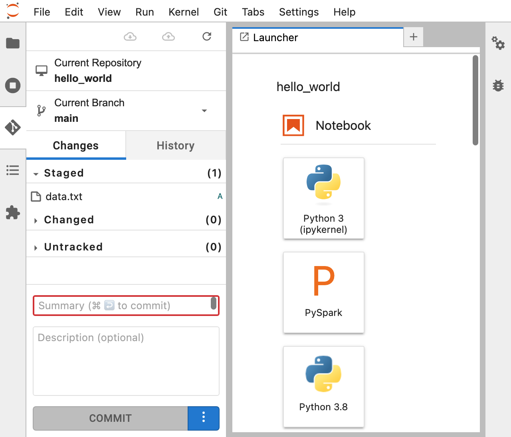

2. Review the changes listed under the "Staged" section. 
    - These are changes that have been added to the staging area and are ready to be committed.

3. In the "Commit" section, enter a commit message that describes the changes you are making.

    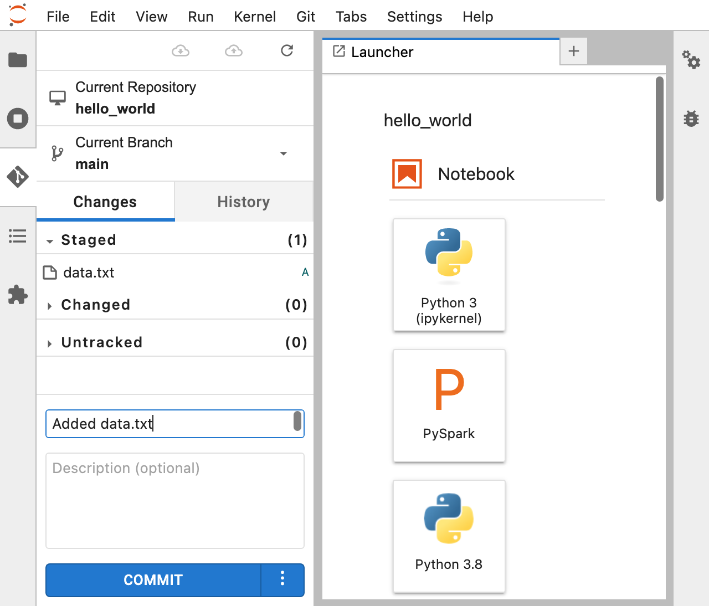

4. Click "Commit". 
    - This will save the changes you have staged in the previous step to your local Git repository.

    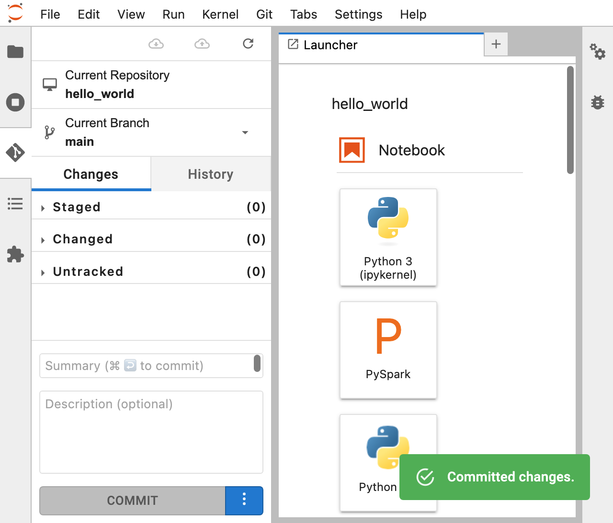

### Viewing commit history

1. Click the "History" tab in the Git plugin.
    - You should see a list of commits, with the most recent one at the top.

    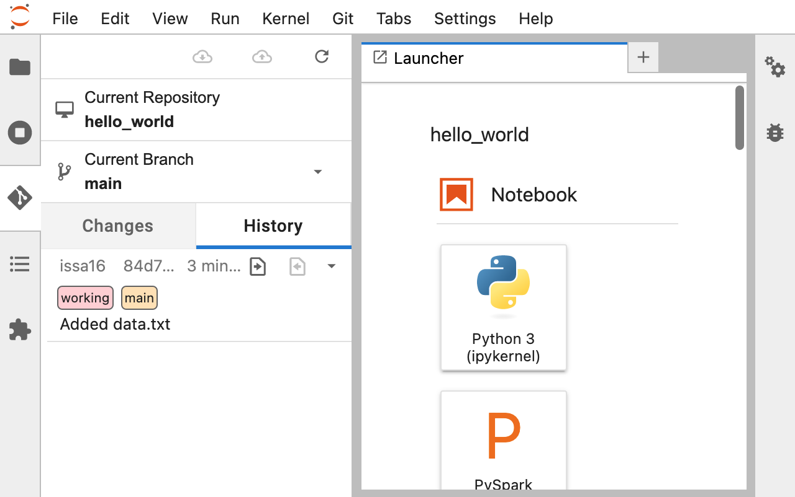

2. Click on a commit to view more details about it, such as the commit message, the author, and the date and time it was committed.

    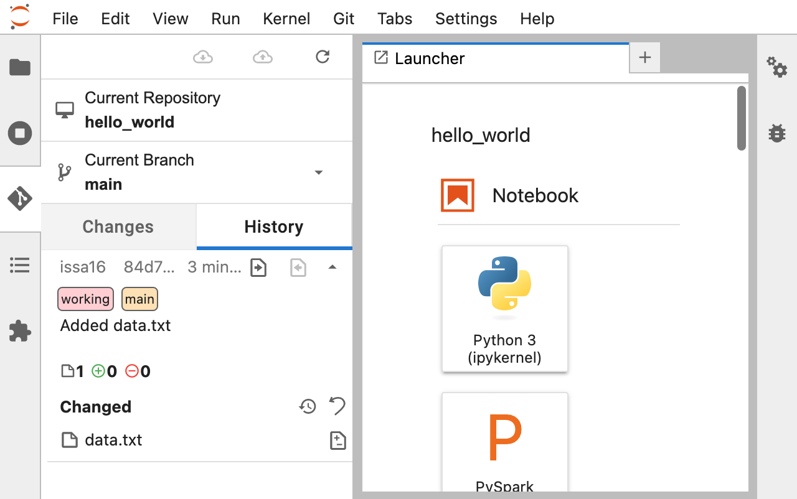

3. You can also click on the "data.txt" file to see the differences between the files in the current commit and the previous one.
    - Need to fix
  
### Add changes
1. Press `ctrl + shift + F`(Windows) to open the File Browser and double click the "hello_world" directory.

    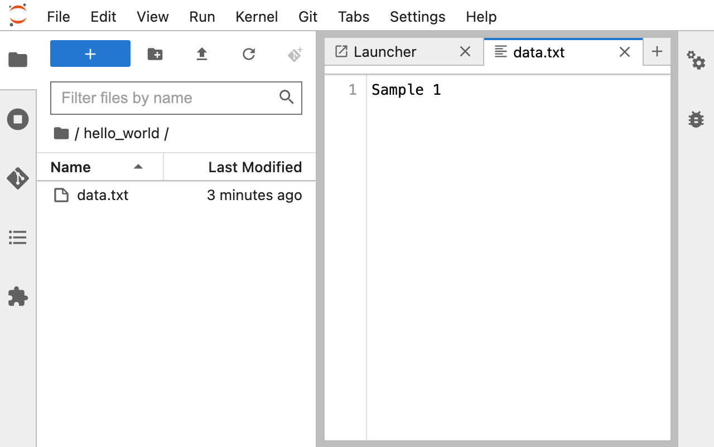

2. Double click the file named "data.txt" and add change the text and press `ctrl + s` to save the file.

    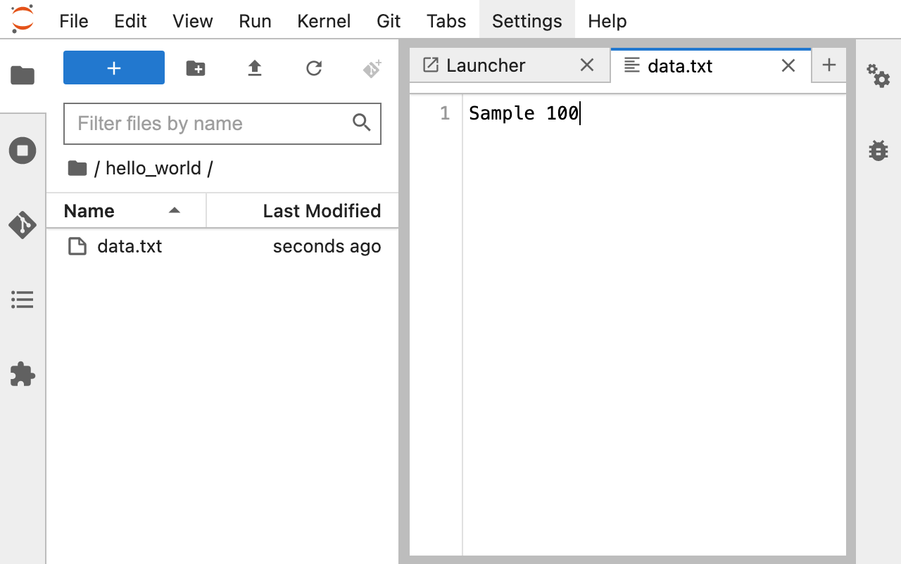

### Ignoring files

1. Create a new file in your project directory and name it ".gitignore". Note that the filename starts with a period (".") and has no file extension.

2. Open the ".gitignore" file in a text editor.

3. Add the names of files or directories that you want to ignore, each on a new line. For example, if you want to ignore a file called "config.ini", add the following line to your .gitignore file: config.ini

4. Save the ".gitignore" file and exit the text editor.

5. Open the Git plugin in the left-hand menu of Jupyter Notebook.

6. Click the "Changes" tab in the Git plugin.

7. You should see your ".gitignore" file listed under the "Untracked Files" section.

8. Right-click on the ".gitignore" file and select "Track".

9. You should now see the ".gitignore" file listed under the "Staged Changes" section.

10.Enter a commit message that describes the changes you are making in the "Commit" section.

11. Click "Commit" to save the changes to your local Git repository.

Summary:

Ignoring files in Git involves creating a ".gitignore" file in your project directory, adding the names of files or directories that you want to ignore to this file, and then committing the changes to your local repository.
